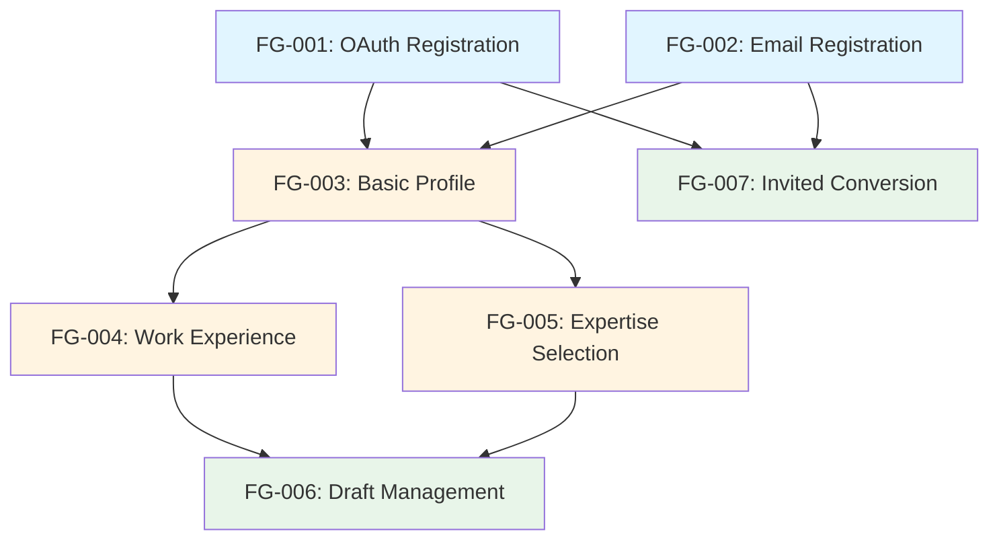

# Story Review & Recommendations for EPIC-003

## 📊 Summary

Reviewed all 7 user stories for EPIC-003 (Advisor Registration). Below are key observations, additional questions, and technical recommendations.

---

## ✅ What's Good

### Story Quality
- ✅ All stories have comprehensive acceptance criteria
- ✅ Clear business context and value propositions
- ✅ Detailed error handling scenarios
- ✅ Non-functional requirements well-defined
- ✅ Test scenarios comprehensive

### Dependencies
- ✅ Logical dependency chain established
- ✅ OAuth (FG-001) and Email (FG-002) can run in parallel
- ✅ Profile stories (FG-003, 004, 005) depend on registration completion

---

## 🔍 Additional Questions for Stories

### STORY-FG-001: OAuth Registration

#### Q1: OAuth Token Storage
**Current Statement:** "OAuth tokens are NOT stored; only profile data is extracted"

**Question:** Should we consider storing refresh tokens for future profile sync?

**Options:**
- **A) No storage (current)** - One-time data import only
  - ✅ Pros: Simpler, no token management, better privacy
  - ❌ Cons: No automatic profile updates

- **B) Store refresh tokens** - Enable periodic sync
  - ✅ Pros: Keep profile up-to-date, better data quality
  - ❌ Cons: Token management complexity, security concerns

**Recommendation:** Start with Option A (current), add Option B in Phase 2 if needed

**Priority:** Low (can defer)

---

#### Q2: LinkedIn Data Import Scope
**Story mentions:** "Import more data from LinkedIn (work history, education)" as future enhancement

**Question:** Should we implement LinkedIn work history import in FG-001 instead of manual entry in FG-004?

**Context:**
- LinkedIn OAuth already provides work history via API
- Would save advisor time (10-15 minutes)
- Reduces manual data entry errors

**Options:**
- **A) Import during OAuth (FG-001)** - Populate work history automatically
  - ✅ Pros: Better UX, faster onboarding, higher completion rates
  - ❌ Cons: Additional OAuth scopes needed, more complex parsing

- **B) Keep manual (FG-004)** - Current design
  - ✅ Pros: Simpler OAuth flow, advisor controls data
  - ❌ Cons: More work for advisor, possible abandonment

**Recommendation:** Implement Option A for LinkedIn OAuth users
- Request additional scope: `r_basicprofile` (includes work history)
- Parse LinkedIn work history and pre-populate FG-004 form
- Allow advisor to edit/remove entries

**Effort:** +8 hours to FG-001
**Impact:** Could increase profile completion by 15-20%

**Priority:** Medium (consider for Sprint 45)

---

### STORY-FG-002: Email Registration

#### Q3: Email Verification Timeout
**Story doesn't specify:** Verification link expiration time

**Question:** How long should email verification links remain valid?

**Options:**
- **A) 24 hours** - Standard practice
- **B) 48 hours** - More lenient
- **C) 7 days** - Maximum flexibility

**Recommendation:** 24 hours (Option A)
- Security best practice
- Aligns with industry standards
- Reduces risk of token hijacking

**Implementation Note:** After expiration, allow "Resend verification email" option

**Priority:** High (needs decision before development)

---

#### Q4: Password Reset Flow
**Story focuses on registration**, but doesn't mention password reset

**Question:** Should password reset be included in FG-002 scope or separate story?

**Recommendation:** Separate story (not part of registration)
- Keep FG-002 focused on registration
- Create new story: "STORY-FG-008: Password Reset Flow"
- Estimate: 8 hours

**Priority:** Medium (needed before launch, but not for MVP)

---

### STORY-FG-003: Basic Profile

#### Q5: Profile Photo Requirements
**Story specifies:** "JPG/PNG, max 5MB, min 400x400px"

**Question:** Should we enforce square aspect ratio or allow any dimensions?

**Context:**
- Marketplace listings typically show circular avatars
- Non-square images may crop poorly

**Options:**
- **A) Enforce square (1:1)** - Best for circular avatars
  - ✅ Pros: Consistent display, no cropping issues
  - ❌ Cons: Advisor may need to edit photo

- **B) Allow any ratio + crop tool** - Flexible with manual adjustment
  - ✅ Pros: Accepts any photo, advisor controls crop
  - ❌ Cons: Additional development (crop UI)

**Recommendation:** Option B - Allow any ratio with crop tool
- Better UX (advisors can use existing photos)
- Common pattern (LinkedIn, Facebook use this)
- Crop tool libraries available (e.g., react-image-crop)

**Effort:** +4 hours for crop UI

**Priority:** Medium (nice-to-have for better UX)

---

#### Q6: Bio Character Limit
**Story specifies:** "100-500 characters"

**Question:** Is 500 characters sufficient for professional bio?

**Analysis:**
- 500 chars = ~75-85 words
- LinkedIn About section: 2600 characters
- Typical professional bio: 150-300 words (1000-2000 chars)

**Recommendation:** Increase to 1000 characters
- Allows 2-3 short paragraphs
- Better storytelling for advisors
- Still fits most UI layouts

**UI Note:** Show character counter and "Expand/Collapse" on marketplace listing

**Priority:** Low (current limit acceptable, but consider increase)

---

### STORY-FG-004: Work Experience

#### Q7: Document Upload Requirements
**Story mentions:** "Document uploads for credentials"

**Question:** Should credential documents be REQUIRED or optional?

**Context:**
- Some advisors may not have digital credentials
- Verification can happen later (Stage 7 - KYC)

**Recommendation:** Make optional for now
- Mark as "Upload credentials (optional)"
- Add banner: "Verified credentials increase trust by 40%"
- Require during KYC phase (separate epic)

**Priority:** Low (current design likely has this)

---

### STORY-FG-005: Expertise Selection

#### Q8: Module Selection Validation
**Story specifies:** "Select 1-7 modules, designate 1-3 as primary"

**Question:** Should we validate that primary modules are subset of selected modules?

**Example Issue:**
- Advisor selects: Constitution, Conflicts, Decision Making (3 modules)
- Tries to mark Succession as primary (not in selected list)

**Recommendation:** Yes, enforce validation
- Primary modules MUST be from selected modules
- Show error: "You can only mark selected modules as primary"
- Disable checkboxes for non-selected modules in primary section

**Priority:** Medium (prevents data inconsistency)

---

### STORY-FG-006: Draft Management

#### Q9: Draft Expiration Policy
**Story specifies:** "Draft archived after 90 days inactive"

**Question:** What happens to advisor account after draft expiration?

**Context:**
- Advisor paid subscription during registration
- Profile never completed (0% → 60%)
- 90 days passed

**Options:**
- **A) Keep account active** - Advisor can complete anytime
  - ✅ Pros: No forced action, advisor retains access
  - ❌ Cons: Incomplete profiles on platform

- **B) Suspend account** - Require profile completion to reactivate
  - ✅ Pros: Maintains quality, encourages completion
  - ❌ Cons: Advisor frustration, potential refund requests

- **C) Hybrid** - Warning emails, then suspension after 120 days
  - ✅ Pros: Balanced approach, gives multiple chances
  - ❌ Cons: More complex logic

**Recommendation:** Option C - Hybrid approach
```
Day 90: "Draft archived, complete profile to appear in marketplace"
Day 105: "Last reminder: Complete profile by Day 120"
Day 120: "Account suspended - contact support to reactivate"
```

**Priority:** Medium (affects subscription policy)

---

### STORY-FG-007: Invited Advisor Conversion

#### Q10: Data Migration Strategy
**Story mentions:** "Pre-fill from invited profile"

**Question:** How do we handle conflicting data between invited profile and marketplace profile?

**Example:**
- Invited profile: Name "John Smith", Bio "Short bio"
- Advisor wants marketplace name "John D. Smith", different bio

**Recommendation:** Show side-by-side comparison UI
- Left column: Existing invited profile data
- Right column: Editable marketplace profile
- Checkbox: "Use existing data" vs "Enter new data"
- Save both versions (invited profile unchanged for that family)

**Priority:** Medium (UX clarity needed)

---

## 🏗️ Technical Recommendations

### TR-1: Subscription Webhook Handling
**Applies to:** STORY-FG-001, FG-002

**Observation:** Stories mention "Account creation blocked until successful payment confirmation via Stripe webhook"

**Recommendation:** Implement webhook queue with retry logic
```python
# Webhook handler pattern
@app.post("/webhooks/stripe")
async def stripe_webhook(request):
    # Verify webhook signature
    # Queue event for processing
    # Return 200 immediately (don't block Stripe)

# Background worker
async def process_subscription_created(event):
    # Activate advisor account
    # Send welcome email
    # Retry on failure (max 3 attempts)
```

**Why:** Stripe webhooks can be delayed or arrive out of order
- Don't block user on webhook
- Show "Processing..." state while waiting
- Timeout after 30 seconds with manual check option

---

### TR-2: OAuth State Management
**Applies to:** STORY-FG-001

**Current:** Story mentions "OAuth state parameter for CSRF protection"

**Recommendation:** Use Redis for OAuth state with TTL
```python
# Store state before OAuth redirect
state = generate_random_string()
redis.setex(f"oauth_state:{state}", 300, json.dumps({
    "provider": "linkedin",
    "created_at": time.time(),
    "return_url": request.headers.get("Referer")
}))

# Validate on callback
stored_state = redis.get(f"oauth_state:{state}")
if not stored_state:
    raise OAuthError("State expired or invalid")
```

**Why:**
- 5-minute TTL prevents replay attacks
- Includes return URL for better UX
- Redis auto-cleanup (no manual deletion needed)

---

### TR-3: Profile Completion Calculation
**Applies to:** STORY-FG-003, FG-006

**Observation:** Multiple stories mention "profile completion percentage"

**Recommendation:** Centralize calculation logic
```python
# Profile completion weights
COMPLETION_WEIGHTS = {
    "photo": 10,
    "name": 10,
    "title": 10,
    "bio": 10,
    "email_verified": 10,
    "work_experience": 10,  # At least 1 entry
    "phone": 10,
    "location": 10,
    "expertise": 10,  # At least 1 module
    "years_experience": 10,
}

def calculate_profile_completion(advisor):
    score = 0
    for field, weight in COMPLETION_WEIGHTS.items():
        if has_value(advisor, field):
            score += weight
    return score
```

**Why:**
- Consistent calculation across all stories
- Easy to adjust weights
- Clear 10% increments (matches epic requirements)

---

### TR-4: Email Reminder Scheduling
**Applies to:** STORY-FG-006

**Story specifies:** "Email reminders at 24h, 3d, 7d, 14d intervals"

**Recommendation:** Use Kubernetes CronJob with database polling
```yaml
# kubernetes/cronjobs/draft-reminders.yaml
apiVersion: batch/v1
kind: CronJob
metadata:
  name: advisor-draft-reminders
spec:
  schedule: "0 10 * * *"  # Daily at 10 AM
  jobTemplate:
    spec:
      template:
        spec:
          containers:
          - name: reminder-job
            image: advisor-service:latest
            command: ["python", "jobs/send_draft_reminders.py"]
```

**Query:**
```sql
-- Find advisors needing reminders
SELECT * FROM advisors
WHERE profile_status = 'draft'
AND profile_completion < 60
AND (
    (NOW() - updated_at) = INTERVAL '24 hours'
    OR (NOW() - updated_at) = INTERVAL '3 days'
    OR (NOW() - updated_at) = INTERVAL '7 days'
    OR (NOW() - updated_at) = INTERVAL '14 days'
)
```

---

### TR-5: Photo Storage Path Strategy
**Applies to:** STORY-FG-001, FG-003

**Recommendation:** Use consistent S3 path structure
```
s3://family-governance-advisors/
  ├── photos/
  │   ├── {advisor_id}/
  │   │   ├── original.jpg
  │   │   ├── thumbnail_200x200.jpg
  │   │   └── marketplace_400x400.jpg
  └── credentials/
      └── {advisor_id}/
          ├── {document_id}_diploma.pdf
          └── {document_id}_certificate.pdf
```

**Why:**
- Organized by advisor_id (easy cleanup)
- Multiple sizes for performance (thumbnail for lists, full for profile)
- Separate credentials folder (different access controls)

---

## 📋 Story Dependency Graph



**Parallel Work Possible:**
- **Sprint 45 Week 1:** FG-001 + FG-002 (different developers)
- **Sprint 45 Week 2:** FG-003 → FG-004 + FG-005 (parallel)
- **Sprint 45 Week 3:** FG-006 + FG-007

---

## 🎯 Priority Questions for Decision

**HIGH Priority (need before Sprint 45 starts):**
1. ❗ Q3: Email verification timeout (affects security)
2. ❗ Q9: Draft expiration policy (affects subscription terms)

**MEDIUM Priority (need during Sprint 45):**
1. ⚠️ Q2: LinkedIn data import (affects story scope)
2. ⚠️ Q8: Module validation logic (prevents data issues)
3. ⚠️ Q10: Data migration UX (affects conversion flow)

**LOW Priority (can decide later or use defaults):**
1. ℹ️ Q1: OAuth token storage (future enhancement)
2. ℹ️ Q5: Photo crop tool (UX improvement)
3. ℹ️ Q6: Bio character limit (current is acceptable)
4. ℹ️ Q7: Document upload requirements (already optional likely)

---

## ✅ Next Steps

1. **Review this document** with Product Owner and Tech Lead
2. **Make decisions** on HIGH priority questions (Q3, Q9)
3. **Update stories** based on decisions
4. **Consider scope changes** for MEDIUM priority items (especially Q2 - LinkedIn import)
5. **Proceed to Sprint Planning** after decisions finalized

---

**Document Status:** Ready for Review
**Review Required By:** Before Sprint 45 Planning
**Reviewers:** Product Owner, Technical Lead, Lana (Requirements Expert)
