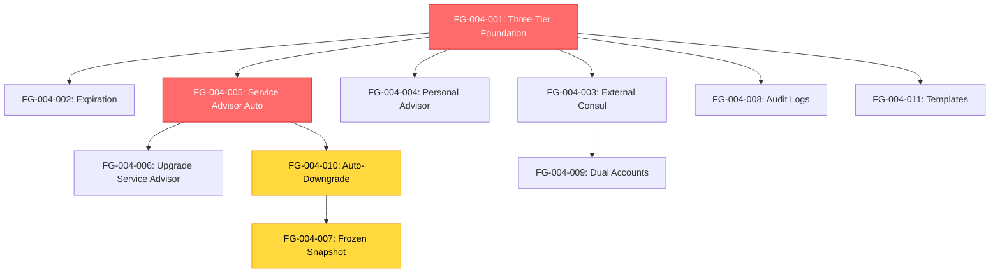

# Story-Level Recommendations for EPIC-004: Advisor Permissions & RBAC

> **Purpose:** Additional questions, technical recommendations, and implementation guidance for all 11 user stories in EPIC-004.
>
> **Audience:** Product Team, Technical Leads, Sprint Planning Team
>
> **Status:** Ready for Review
>
> **Created:** 2025-10-20

---

## 📊 Story Overview & Dependencies

### Sprint Distribution

**Sprint 45 (Foundation - 4 stories):**
- STORY-FG-004-001: Consul Three-Tier Permissions (16h, 8 SP) - **Core Foundation**
- STORY-FG-004-002: Expiration Dates (12h, 5 SP)
- STORY-FG-004-003: External Consul Full Access (12h, 5 SP)
- STORY-FG-004-004: Personal Advisor Defaults (16h, 8 SP)

**Sprint 46 (Service Advisor Lifecycle - 4 stories):**
- STORY-FG-004-005: Service Advisor Auto-Permissions (20h, 8 SP) - **Critical Path**
- STORY-FG-004-006: Consul Upgrades Service Advisor (12h, 5 SP)
- STORY-FG-004-007: Frozen Data After Completion (24h, 13 SP) - **Most Complex**
- STORY-FG-004-010: Auto-Downgrade Permissions (20h, 8 SP)

**Sprint 47 (Audit & Multi-Portal - 3 stories):**
- STORY-FG-004-008: Audit Log Reports (16h, 8 SP)
- STORY-FG-004-009: Dual Accounts (16h, 8 SP)
- STORY-FG-004-011: Permission Templates (16h, 8 SP)

### Dependency Graph



**Legend:**
- 🔴 Red: Critical Foundation (FG-001, FG-005)
- 🟡 Yellow: Complex Implementation (FG-007, FG-010)
- 🔵 Blue: Standard Stories

---

## ❓ Additional Questions (12 Total)

### 🔴 HIGH Priority (Immediate Decisions Needed)

#### Q1: "Related Only" Ownership Definition
**Context:** Stories FG-004-001, FG-004-004, FG-004-005, FG-004-006

**Question:** How do we define "owns this material" for View+Modify (related) permission?

**Options:**
- **Option A:** `created_by_user_id = current_advisor_id` (creator owns forever)
  - ✅ Simple, clear ownership
  - ✅ Easy to query: `WHERE created_by = :advisor_id`
  - ❌ Doesn't handle reassignment (what if Admin transfers task ownership?)

- **Option B:** `created_by OR assigned_to = current_advisor_id`
  - ✅ More flexible for task assignment scenarios
  - ✅ Handles common workflow: "Admin creates task, assigns to Advisor"
  - ❌ More complex queries, potential security gaps
  - ❌ Need to track `assigned_to` for every entity type

- **Option C:** Hybrid - `created_by` for documents/workshops, `created_by OR assigned_to` for tasks
  - ✅ Entity-specific rules match real-world usage
  - ❌ Inconsistent behavior across sections
  - ❌ Complex documentation and testing

**Recommendation:** **Option A** for MVP (Sprint 45), revisit Option C in Sprint 48 after user feedback.

**Blocker Status:** 🔴 **BLOCKS Sprint 45** - Affects FG-001 implementation

---

#### Q2: Permission Expiration Job Execution Strategy
**Context:** Story FG-004-002

**Question:** How should permission expiration scheduled job run in Kubernetes cluster?

**Options:**
- **Option A:** Kubernetes CronJob (separate pod scheduled daily at 00:00 UTC)
  - ✅ Standard K8s pattern, isolated execution
  - ✅ Easy monitoring via K8s dashboard
  - ✅ Automatic retries on failure
  - ❌ Additional pod resources

- **Option B:** FastAPI scheduled task in auth_service (APScheduler)
  - ✅ No additional pods, simpler deployment
  - ✅ Direct access to auth service functions
  - ❌ Coupled to auth_service restarts
  - ❌ No isolation if auth_service crashes

- **Option C:** Turbo Stack scheduled job (TypeScript/Hono service)
  - ✅ Aligns with "Turbo First" policy
  - ✅ Can use Better Auth directly
  - ❌ Requires new Turbo service creation

**Recommendation:** **Option A** (K8s CronJob) - standard pattern, already used in FG architecture.

**Technical Detail:**
```yaml
# kubernetes/cronjobs/permission-expiration-checker.yaml
apiVersion: batch/v1
kind: CronJob
metadata:
  name: permission-expiration-checker
spec:
  schedule: "0 0 * * *"  # Daily at 00:00 UTC
  jobTemplate:
    spec:
      template:
        spec:
          containers:
          - name: expiration-checker
            image: family-governance/permission-expiration:latest
            env:
            - name: DATABASE_URL
              valueFrom:
                secretKeyRef:
                  name: auth-db-secret
                  key: connection-string
          restartPolicy: OnFailure
```

**Blocker Status:** 🟡 **Affects Sprint 45 Planning** - Architecture decision needed

---

#### Q3: Frozen Snapshot Query Performance
**Context:** Stories FG-004-007, FG-004-010

**Question:** How do we ensure fast queries for frozen snapshot data (Service Advisor view-only mode)?

**Problem:**
- Service Advisor completed service on 2025-03-15
- Needs to query: `WHERE created_by_user_id = advisor_id AND created_at BETWEEN service_start_date AND service_end_date`
- Family has 10,000+ documents, 500+ meetings, 1,000+ tasks
- Without optimization, queries could take 5-10 seconds

**Options:**
- **Option A:** Composite index on `(created_by_user_id, created_at, family_id)`
  - ✅ Fast lookups for frozen snapshot queries
  - ✅ Standard database pattern
  - ❌ Increases index size (~15% storage overhead)

- **Option B:** Materialized view for completed service engagements
  - ✅ Pre-computed results, sub-100ms queries
  - ❌ Complex maintenance, potential staleness
  - ❌ Requires database migration expertise

- **Option C:** Caching layer (Redis) with 24h TTL
  - ✅ Ultra-fast reads after first query
  - ❌ Cache invalidation complexity
  - ❌ Additional Redis infrastructure

**Recommendation:** **Option A** (Composite Index) for MVP, evaluate Option C if performance issues arise.

**SQL Example:**
```sql
-- Create composite index for fast frozen snapshot queries
CREATE INDEX idx_documents_frozen_snapshot
ON documents (created_by_user_id, created_at, family_id)
WHERE created_at IS NOT NULL;

-- Query pattern (should use index)
EXPLAIN ANALYZE
SELECT * FROM documents
WHERE created_by_user_id = '...'
  AND created_at BETWEEN '2025-01-01' AND '2025-03-15'
  AND family_id = '...'
ORDER BY created_at DESC;

-- Expected: Index Scan using idx_documents_frozen_snapshot
-- Cost: ~5-10ms for 1000 documents
```

**Blocker Status:** 🟡 **Affects Sprint 46** - Must decide before FG-007 implementation

---

### 🟡 MEDIUM Priority (Sprint Planning Considerations)

#### Q4: Permission Template Storage Architecture
**Context:** Story FG-004-011

**Question:** Where and how should permission templates be stored?

**Options:**
- **Option A:** System-wide templates (same for all families) stored in `permission_templates` table
  - ✅ Consistent templates across platform
  - ✅ Easy platform upgrades (add new templates)
  - ❌ No family customization

- **Option B:** Family-specific templates with system defaults
  - ✅ Families can create custom templates (e.g., "Smith Family Workshop Specialist")
  - ✅ System provides defaults families can copy/modify
  - ❌ More complex UI for template management
  - ❌ Requires `family_id` in `permission_templates` table

- **Option C:** JSON config file in codebase (hardcoded templates)
  - ✅ Simple, no database overhead
  - ✅ Easy to version control template changes
  - ❌ Cannot be modified without deployment
  - ❌ No family-specific templates possible

**Recommendation:** **Option B** for flexibility - Sprint 47 can implement template management UI.

**Schema Suggestion:**
```sql
CREATE TABLE permission_templates (
  id UUID PRIMARY KEY,
  family_id UUID NULL,  -- NULL = system template, value = family template
  name VARCHAR(100) NOT NULL,
  description TEXT,
  is_system BOOLEAN DEFAULT FALSE,
  sections JSONB NOT NULL,  -- {section_name: permission_level}
  created_by UUID NOT NULL,
  created_at TIMESTAMP DEFAULT NOW(),
  updated_at TIMESTAMP DEFAULT NOW()
);

-- Example system template
{
  "id": "...",
  "family_id": null,
  "name": "External Consul",
  "is_system": true,
  "sections": {
    "constitution": "modify_all",
    "meetings": "modify_all",
    "tasks": "modify_all",
    "billing": "none",
    "extensions": "none"
  }
}
```

---

#### Q5: Audit Log Retention vs Export Frequency
**Context:** Story FG-004-008

**Question:** If default retention is 7 years, do we need optimizations for large exports?

**Calculation:**
- Family with 5 advisors, permission changes monthly = 60 changes/year
- Over 7 years = 420 audit log records per family
- Platform with 100 families = 42,000 total records
- CSV export of 42,000 rows = ~5MB file

**Concern:** Admins exporting "all families, all time" could generate massive files.

**Options:**
- **Option A:** Limit export to max 10,000 records (show warning if exceeded)
  - ✅ Prevents server overload
  - ❌ Incomplete audit trail for large families

- **Option B:** Async export with email delivery for large datasets
  - ✅ No timeout issues
  - ✅ Better UX for large exports
  - ❌ Requires background job infrastructure

- **Option C:** Paginated export (download in chunks)
  - ✅ User controls size
  - ❌ Awkward UX (multiple files to stitch together)

**Recommendation:** **Option B** - Already have background job pattern in FG. Implement threshold:
- < 1,000 records: Immediate download
- \> 1,000 records: Email with download link (expires in 7 days)

---

#### Q6: Multi-Portal Email Validation Edge Case
**Context:** Story FG-004-009

**Question:** What happens if advisor tries to use SAME email on both portals?

**Scenario:**
1. Advisor registers on Family Portal with `advisor@example.com`
2. Later, tries to register on Advisor Portal with `advisor@example.com`

**Current Requirement:** "Per-portal email uniqueness" - should be ALLOWED (different contexts).

**But consider:**
- Same person, same email, different roles (internal Family Member vs external Advisor)
- Risk of confusion: "Which portal am I on?"
- Password management: Same password on both portals? Different?

**Options:**
- **Option A:** Allow same email on both portals (as specified)
  - ✅ Follows requirement
  - ⚠️ User confusion risk

- **Option B:** Show warning on registration: "This email is already used on Family Portal. Continue?"
  - ✅ Prevents accidental dual registration
  - ✅ User confirms intentional multi-portal usage

- **Option C:** Prohibit same email across portals (force different emails)
  - ✅ Clear separation of contexts
  - ❌ Violates "independent accounts" requirement
  - ❌ Inconvenient for advisors serving one family internally + others externally

**Recommendation:** **Option B** - Warning message + confirmation for better UX.

---

### 🟢 LOW Priority (Future Enhancements)

#### Q7: Permission Change Notifications to Advisors
**Context:** Stories FG-001, FG-002, FG-006

**Current Status:** Story FG-001 AC explicitly states "Advisor notification about permission changes: NOT implemented in this Story (future enhancement)".

**Question:** Should we add notification story to Sprint 47 or defer to Sprint 48+?

**Benefit:**
- Advisors know when access changes (improved transparency)
- Reduces confusion ("Why can't I edit this anymore?")

**Implementation Estimate:** 8h (use existing turbo_mail service)

**Recommendation:** Add to Sprint 47 backlog as **STORY-FG-004-012** (low priority, 4 SP).

---

#### Q8: Bulk Permission Updates
**Context:** Story FG-004-001

**Question:** Should Consul be able to select multiple advisors and apply same template to all at once?

**Use Case:** Family hires 3 Service Advisors with identical permission needs.

**Current Workflow:**
1. Open Permissions Editor for Advisor 1
2. Apply "Workshop Facilitator" template
3. Save
4. Repeat for Advisor 2
5. Repeat for Advisor 3

**Enhanced Workflow with Bulk:**
1. Select checkboxes for Advisors 1, 2, 3
2. Click "Apply Template to Selected"
3. Choose "Workshop Facilitator"
4. Confirm (one save operation)

**Estimate:** 12h (Sprint 47 enhancement)

**Recommendation:** Defer to Sprint 48+ (nice-to-have, not MVP).

---

#### Q9: Permission History Timeline View
**Context:** Story FG-004-008

**Question:** In addition to CSV/PDF export, should we show audit log as timeline in UI?

**Benefit:**
- Visual representation of permission changes over time
- Easier to spot patterns (e.g., "All changes made on same day = bulk operation")

**Current:** Export-only from Settings (no dedicated UI)

**Consideration:** Epic explicitly states "Dedicated Audit Log UI tab/page (only export from settings)" is OUT OF SCOPE.

**Recommendation:** Respect scope decision - CSV/PDF export sufficient for MVP. Revisit in Q2 2026 based on user feedback.

---

#### Q10: Permission Dry-Run Mode
**Question:** Should permission changes have "Preview Impact" mode before saving?

**Use Case:**
- Consul about to downgrade Service Advisor from "Modify All" to "View Only"
- Wants to see: "17 workshops will become read-only. Advisor will lose edit access to 42 documents."

**Implementation Complexity:** Medium (8-12h to add impact calculator)

**Recommendation:** Add to backlog as **STORY-FG-004-013** for Sprint 48+ (UX polish).

---

#### Q11: Permission Conflict Resolution UI
**Question:** How should UI handle conflicting permission changes by multiple Consuls?

**Current Strategy (from FG-001):** "Last save wins (optimistic locking)" with warning.

**Alternative:** Show detailed diff of conflicting changes:
```
Consul A changed at 10:15 AM:
- Workshops: View → Modify All

Consul B (you) trying to change at 10:17 AM:
- Workshops: View → Modify (related)
- Meetings: None → View

Conflict on: Workshops
Your action: [Overwrite] [Merge] [Cancel]
```

**Recommendation:** MVP uses simple warning (as specified). Consider enhanced diff UI in Q2 2026 if conflicts become common.

---

#### Q12: Service Advisor Profile Visibility After Completion
**Question:** When Service Advisor's engagement completes and permissions downgrade to view-only, should their profile badge change?

**Example:**
- Active Service Advisor: Green badge "ACTIVE"
- Completed Service Advisor: Gray badge "COMPLETED" or "VIEW-ONLY"

**Benefit:** Visual indicator in advisor list showing who has active vs historical access.

**Implementation:** 4h (Sprint 46 or 47)

**Recommendation:** Add to FG-004-010 as additional AC (low-cost UX improvement).

---

## 🔧 Technical Recommendations (8 Total)

### TR-1: Three-Tier Permission Validation Pattern

**Apply to:** All stories (FG-001 through FG-011)

**Pattern:** Backend permission checks on EVERY write operation

```python
# backend/auth_service/services/permission_validator.py
from enum import Enum
from typing import Optional

class PermissionLevel(Enum):
    NONE = "none"
    VIEW = "view"
    MODIFY_RELATED = "modify_related"
    MODIFY_ALL = "modify_all"

class PermissionValidator:
    @staticmethod
    def can_modify(
        user_permission: PermissionLevel,
        resource_created_by: str,
        current_user_id: str
    ) -> bool:
        """
        Validate if user can modify resource based on permission tier.

        Returns:
            True if modification allowed, False otherwise
        """
        if user_permission == PermissionLevel.MODIFY_ALL:
            return True

        if user_permission == PermissionLevel.MODIFY_RELATED:
            return resource_created_by == current_user_id

        return False  # VIEW or NONE cannot modify

# Usage in FastAPI route
from fastapi import HTTPException, status

@router.put("/workshops/{workshop_id}")
async def update_workshop(
    workshop_id: str,
    data: WorkshopUpdate,
    current_user: User = Depends(get_current_user),
    db: Session = Depends(get_db)
):
    # Fetch workshop
    workshop = db.query(Workshop).filter(
        Workshop.id == workshop_id,
        Workshop.family_id == current_user.family_id  # Multi-tenancy
    ).first()

    if not workshop:
        raise HTTPException(404, "Workshop not found")

    # Get user's permission for Workshops section
    user_permission = get_user_permission(current_user.id, "workshops", db)

    # CRITICAL: Validate permission
    if not PermissionValidator.can_modify(
        user_permission,
        workshop.created_by_user_id,
        current_user.id
    ):
        raise HTTPException(
            status.HTTP_403_FORBIDDEN,
            detail="Insufficient permissions. You can only modify your own workshops."
        )

    # Proceed with update
    workshop.title = data.title
    db.commit()
    return workshop
```

**Why Critical:** Prevents privilege escalation attacks where malicious user crafts API call bypassing UI restrictions.

---

### TR-2: Frozen Snapshot Query Optimization

**Apply to:** Stories FG-004-007, FG-004-010

**Pattern:** Use composite indexes and date range filtering

```sql
-- Migration: Add composite indexes for frozen snapshot queries
-- Run in: backend/auth_service/migrations/

-- Documents table
CREATE INDEX idx_documents_frozen_snapshot
ON documents (created_by_user_id, created_at, family_id)
WHERE created_at IS NOT NULL;

-- Meetings table
CREATE INDEX idx_meetings_frozen_snapshot
ON meetings (created_by_user_id, created_at, family_id)
WHERE created_at IS NOT NULL;

-- Tasks table
CREATE INDEX idx_tasks_frozen_snapshot
ON tasks (created_by_user_id, created_at, family_id)
WHERE created_at IS NOT NULL;

-- Workshops table
CREATE INDEX idx_workshops_frozen_snapshot
ON workshops (created_by_user_id, created_at, family_id)
WHERE created_at IS NOT NULL;
```

```python
# backend/auth_service/services/frozen_snapshot_service.py
from datetime import datetime
from typing import List

class FrozenSnapshotService:
    @staticmethod
    def get_advisor_documents_frozen(
        advisor_id: str,
        service_start_date: datetime,
        service_end_date: datetime,
        family_id: str,
        db: Session
    ) -> List[Document]:
        """
        Fetch documents created by advisor during service period.
        Uses optimized index for fast lookups.
        """
        return db.query(Document).filter(
            Document.created_by_user_id == advisor_id,
            Document.created_at >= service_start_date,
            Document.created_at <= service_end_date,
            Document.family_id == family_id
        ).order_by(Document.created_at.desc()).all()

        # Query execution plan should show:
        # Index Scan using idx_documents_frozen_snapshot
        # Cost: ~5-15ms for 1000 documents
```

**Performance Target:** < 100ms for queries returning up to 1,000 records.

---

### TR-3: Permission Expiration Job with Monitoring

**Apply to:** Story FG-004-002

**Pattern:** K8s CronJob with alerting on failures

```yaml
# kubernetes/cronjobs/permission-expiration-checker.yaml
apiVersion: batch/v1
kind: CronJob
metadata:
  name: permission-expiration-checker
  namespace: family-governance
spec:
  schedule: "0 0 * * *"  # Daily at 00:00 UTC
  successfulJobsHistoryLimit: 3
  failedJobsHistoryLimit: 3
  jobTemplate:
    spec:
      template:
        metadata:
          labels:
            app: permission-expiration
        spec:
          containers:
          - name: expiration-checker
            image: family-governance/permission-expiration:latest
            env:
            - name: DATABASE_URL
              valueFrom:
                secretKeyRef:
                  name: auth-db-secret
                  key: connection-string
            - name: NOTIFICATION_SERVICE_URL
              value: "http://turbo-mail:8017"
          restartPolicy: OnFailure
```

```python
# scripts/permission_expiration_checker.py
import logging
from datetime import datetime, timezone
from sqlalchemy import create_engine
from sqlalchemy.orm import sessionmaker

logging.basicConfig(level=logging.INFO)
logger = logging.getLogger(__name__)

def check_expired_permissions():
    """
    Check for expired permissions and revoke access.
    Sends notifications to advisors and admins.
    """
    try:
        # Connect to database
        engine = create_engine(os.getenv("DATABASE_URL"))
        Session = sessionmaker(bind=engine)
        db = Session()

        now = datetime.now(timezone.utc)

        # Find expired permissions
        expired_permissions = db.query(AdvisorPermission).filter(
            AdvisorPermission.expiration_date <= now,
            AdvisorPermission.status == 'active'
        ).all()

        logger.info(f"Found {len(expired_permissions)} expired permissions")

        for permission in expired_permissions:
            # Update status
            permission.status = 'expired'

            # Add to token blacklist
            add_to_blacklist(permission.advisor_id)

            # Send notification to advisor
            send_expiration_notification(
                advisor_email=permission.advisor.email,
                family_name=permission.family.name,
                expiration_date=permission.expiration_date
            )

            # Send notification to admin/consul
            send_admin_notification(
                admin_email=permission.family.admin_email,
                advisor_name=permission.advisor.name,
                expiration_date=permission.expiration_date
            )

            # Log in audit trail
            log_audit_event(
                action="permission_expired",
                advisor_id=permission.advisor_id,
                family_id=permission.family_id,
                details=f"Permissions expired on {permission.expiration_date}"
            )

        db.commit()
        logger.info("✅ Permission expiration check completed successfully")

    except Exception as e:
        logger.error(f"❌ Permission expiration check failed: {str(e)}")
        # Send alert to DevOps (use existing alert system)
        send_devops_alert(f"Permission expiration job failed: {str(e)}")
        raise

if __name__ == "__main__":
    check_expired_permissions()
```

**Monitoring:**
- CloudWatch alarm if job fails 2+ times in 7 days
- Slack notification to #family-governance-ops channel

---

### TR-4: Audit Log Async Export Pattern

**Apply to:** Story FG-004-008

**Pattern:** Background job for large exports

```python
# backend/audit_service/routes/audit_export.py
from fastapi import APIRouter, BackgroundTasks, Depends
from celery import shared_task

router = APIRouter()

SYNC_EXPORT_THRESHOLD = 1000  # Records

@router.post("/audit/export")
async def export_audit_log(
    params: AuditExportParams,
    background_tasks: BackgroundTasks,
    current_user: User = Depends(get_admin_user),
    db: Session = Depends(get_db)
):
    """
    Export audit log to CSV or PDF.

    - < 1000 records: Immediate download
    - >= 1000 records: Async export with email notification
    """
    # Count records matching filter
    record_count = db.query(AuditLog).filter(
        # Apply filters from params
    ).count()

    if record_count < SYNC_EXPORT_THRESHOLD:
        # Immediate export
        file_path = generate_audit_report(params, db)
        return FileResponse(
            path=file_path,
            filename=f"audit_log_{params.family_name}_{params.start_date}_{params.end_date}.{params.format}",
            media_type="text/csv" if params.format == "csv" else "application/pdf"
        )
    else:
        # Async export
        background_tasks.add_task(
            generate_audit_report_async,
            params=params,
            user_email=current_user.email,
            user_id=current_user.id
        )

        return {
            "message": f"Export queued. You will receive an email with download link when ready. (~{record_count} records)"
        }

@shared_task
def generate_audit_report_async(params: AuditExportParams, user_email: str, user_id: str):
    """
    Background task for large audit log exports.
    """
    try:
        # Generate report
        file_path = generate_audit_report(params, db=get_db_session())

        # Upload to S3 with 7-day expiration
        download_url = upload_to_s3(file_path, expires_in_days=7)

        # Send email with download link
        send_email(
            to=user_email,
            subject="Your audit log export is ready",
            body=f"Download your report: {download_url}\n\nLink expires in 7 days."
        )

        logger.info(f"✅ Async audit export completed for user {user_id}")

    except Exception as e:
        logger.error(f"❌ Async audit export failed for user {user_id}: {str(e)}")
        send_email(
            to=user_email,
            subject="Audit log export failed",
            body=f"Your export request failed. Please contact support.\n\nError: {str(e)}"
        )
```

---

### TR-5: Multi-Portal Registration Validation

**Apply to:** Story FG-004-009

**Pattern:** Portal-specific email uniqueness check

```python
# backend/auth_service/services/multi_portal_validator.py
from enum import Enum

class Portal(Enum):
    FAMILY_PORTAL = "family"
    ADVISOR_PORTAL = "advisor"

class MultiPortalValidator:
    @staticmethod
    def is_email_available(
        email: str,
        portal: Portal,
        db: Session
    ) -> tuple[bool, Optional[str]]:
        """
        Check if email is available for registration on specific portal.

        Returns:
            (is_available, warning_message)
        """
        # Check if email exists on target portal
        existing_user = db.query(User).filter(
            User.email == email,
            User.portal == portal.value
        ).first()

        if existing_user:
            return (False, f"This email is already registered on {portal.value.title()} Portal")

        # Check if email exists on OTHER portal
        other_portal = Portal.ADVISOR_PORTAL if portal == Portal.FAMILY_PORTAL else Portal.FAMILY_PORTAL
        other_portal_user = db.query(User).filter(
            User.email == email,
            User.portal == other_portal.value
        ).first()

        if other_portal_user:
            # Email exists on other portal - show warning but allow
            return (True, f"⚠️ This email is already used on {other_portal.value.title()} Portal. You will have separate accounts. Continue?")

        # Email available, no warnings
        return (True, None)

# Usage in registration endpoint
@router.post("/auth/register")
async def register(
    data: RegisterRequest,
    portal: Portal = Portal.FAMILY_PORTAL,  # From subdomain or header
    db: Session = Depends(get_db)
):
    # Validate email availability
    is_available, warning = MultiPortalValidator.is_email_available(
        email=data.email,
        portal=portal,
        db=db
    )

    if not is_available:
        raise HTTPException(
            status_code=status.HTTP_409_CONFLICT,
            detail=warning
        )

    # If warning exists, frontend should show confirmation dialog
    # (handled in frontend, backend just returns info)

    # Proceed with registration
    new_user = User(
        email=data.email,
        portal=portal.value,
        # ... other fields
    )
    db.add(new_user)
    db.commit()

    return {
        "user_id": new_user.id,
        "warning": warning  # Frontend shows if present
    }
```

---

### TR-6: Permission Template JSON Schema

**Apply to:** Story FG-004-011

**Pattern:** Flexible JSONB storage with validation

```sql
-- Database schema for permission templates
CREATE TABLE permission_templates (
  id UUID PRIMARY KEY DEFAULT gen_random_uuid(),
  family_id UUID NULL,  -- NULL = system template
  name VARCHAR(100) NOT NULL,
  description TEXT,
  is_system BOOLEAN DEFAULT FALSE,
  sections JSONB NOT NULL,
  created_by UUID NOT NULL,
  created_at TIMESTAMP DEFAULT NOW(),
  updated_at TIMESTAMP DEFAULT NOW(),

  CONSTRAINT valid_sections CHECK (
    jsonb_typeof(sections) = 'object'
  )
);

-- Example template data
INSERT INTO permission_templates (id, family_id, name, is_system, sections, created_by) VALUES
(
  gen_random_uuid(),
  NULL,  -- System template
  'External Consul',
  TRUE,
  '{
    "constitution": "modify_all",
    "meetings": "modify_all",
    "communication": "modify_all",
    "tasks": "modify_all",
    "workshops": "modify_all",
    "conflict_resolution": "modify_all",
    "succession": "modify_all",
    "education": "modify_all",
    "philanthropy": "modify_all",
    "documents": "modify_all",
    "consultations": "modify_all",
    "billing": "none",
    "extensions": "none"
  }'::jsonb,
  'system'
);
```

```python
# backend/auth_service/schemas/permission_template.py
from pydantic import BaseModel, validator
from typing import Dict
from enum import Enum

class PermissionLevel(str, Enum):
    NONE = "none"
    VIEW = "view"
    MODIFY_RELATED = "modify_related"
    MODIFY_ALL = "modify_all"

class PermissionTemplateCreate(BaseModel):
    name: str
    description: str = ""
    sections: Dict[str, PermissionLevel]

    @validator('sections')
    def validate_sections(cls, v):
        """Validate all section values are valid permission levels."""
        valid_levels = {level.value for level in PermissionLevel}
        for section, level in v.items():
            if level not in valid_levels:
                raise ValueError(f"Invalid permission level '{level}' for section '{section}'")
        return v

    @validator('name')
    def validate_name(cls, v):
        """Ensure template name is not empty and unique."""
        if not v or len(v.strip()) == 0:
            raise ValueError("Template name cannot be empty")
        return v.strip()
```

---

### TR-7: Service Lifecycle State Machine

**Apply to:** Stories FG-004-005, FG-004-007, FG-004-010

**Pattern:** Clear state transitions with validation

```python
# backend/auth_service/models/service_engagement.py
from enum import Enum
from sqlalchemy import Column, String, DateTime, Boolean, Enum as SQLEnum

class ServiceStatus(str, Enum):
    ACTIVE = "active"
    COMPLETED = "completed"
    CANCELLED = "cancelled"

class ServiceEngagement(Base):
    __tablename__ = "service_engagements"

    id = Column(UUID, primary_key=True, default=uuid.uuid4)
    family_id = Column(UUID, nullable=False)
    advisor_id = Column(UUID, nullable=False)
    service_type = Column(String(50), nullable=False)

    status = Column(SQLEnum(ServiceStatus), default=ServiceStatus.ACTIVE, nullable=False)

    service_start_date = Column(DateTime, nullable=False)
    service_end_date = Column(DateTime, nullable=True)

    # Frozen snapshot boundaries
    frozen_snapshot_start = Column(DateTime, nullable=True)
    frozen_snapshot_end = Column(DateTime, nullable=True)

    created_at = Column(DateTime, default=datetime.utcnow)
    updated_at = Column(DateTime, default=datetime.utcnow, onupdate=datetime.utcnow)

# backend/auth_service/services/service_lifecycle.py
class ServiceLifecycleService:
    @staticmethod
    def complete_service(
        engagement_id: str,
        db: Session
    ) -> ServiceEngagement:
        """
        Transition service from ACTIVE to COMPLETED.
        Triggers permission downgrade and frozen snapshot creation.
        """
        engagement = db.query(ServiceEngagement).filter(
            ServiceEngagement.id == engagement_id
        ).first()

        if not engagement:
            raise ValueError(f"Service engagement {engagement_id} not found")

        if engagement.status != ServiceStatus.ACTIVE:
            raise ValueError(f"Cannot complete service in {engagement.status} status")

        # Update engagement status
        engagement.status = ServiceStatus.COMPLETED
        engagement.service_end_date = datetime.now(timezone.utc)

        # Set frozen snapshot boundaries
        engagement.frozen_snapshot_start = engagement.service_start_date
        engagement.frozen_snapshot_end = engagement.service_end_date

        # Downgrade advisor permissions to view-only
        downgrade_permissions_to_view_only(
            advisor_id=engagement.advisor_id,
            family_id=engagement.family_id,
            db=db
        )

        # Log in audit trail
        log_audit_event(
            action="service_completed",
            advisor_id=engagement.advisor_id,
            family_id=engagement.family_id,
            details=f"Service completed. Permissions downgraded to view-only. Frozen snapshot: {engagement.frozen_snapshot_start} - {engagement.frozen_snapshot_end}"
        )

        # Send notification to advisor
        send_service_completion_notification(
            advisor_email=engagement.advisor.email,
            family_name=engagement.family.name,
            service_end_date=engagement.service_end_date
        )

        db.commit()
        return engagement
```

**State Transition Rules:**
```
ACTIVE → COMPLETED: ✅ Normal flow (triggered by Service Marketplace)
ACTIVE → CANCELLED: ✅ If engagement terminated early
COMPLETED → ACTIVE: ❌ Cannot reactivate (must create new engagement)
CANCELLED → ACTIVE: ❌ Cannot reactivate
COMPLETED → CANCELLED: ❌ Invalid transition
```

---

### TR-8: Audit Log Query Optimization

**Apply to:** Story FG-004-008

**Pattern:** Indexed filtering for fast exports

```sql
-- Migration: Add composite indexes for audit log queries
CREATE INDEX idx_audit_log_export
ON permission_audit_log (family_id, timestamp DESC, action)
WHERE timestamp IS NOT NULL;

-- Query pattern for filtered export
EXPLAIN ANALYZE
SELECT
  timestamp,
  actor_name,
  action,
  advisor_name,
  advisor_role,
  sections_changed,
  permission_levels,
  details
FROM permission_audit_log
WHERE family_id = '...'
  AND timestamp BETWEEN '2024-01-01' AND '2025-01-01'
  AND action IN ('grant', 'revoke', 'modify')
ORDER BY timestamp DESC
LIMIT 10000;

-- Expected: Index Scan using idx_audit_log_export
-- Cost: ~10-20ms for 10,000 records
```

---

## 🎯 Sprint Readiness Checklist

### Sprint 45 Blockers (Must Resolve Before Sprint Starts)

- [ ] **Q1 Resolved:** "Related Only" ownership definition finalized
  - **Decision Needed By:** Sprint 45 Day 1
  - **Impact:** BLOCKS FG-001 implementation

- [ ] **Q2 Resolved:** Permission expiration job architecture decided
  - **Decision Needed By:** Sprint 45 Planning
  - **Impact:** Affects FG-002 design

- [ ] **TR-1 Implemented:** Permission validation pattern documented
  - **Owner:** Tech Lead
  - **Deliverable:** Code template + documentation

### Sprint 46 Blockers

- [ ] **Q3 Resolved:** Frozen snapshot query optimization strategy chosen
  - **Decision Needed By:** Sprint 46 Day 1
  - **Impact:** BLOCKS FG-007 (most complex story)

- [ ] **TR-2 Implemented:** Database indexes created for frozen snapshots
  - **Owner:** Database Team
  - **Deliverable:** Migration scripts + performance tests

### Sprint 47 Considerations

- [ ] **Q4 Resolved:** Permission template storage architecture decided
  - **Decision Needed By:** Sprint 47 Planning
  - **Impact:** Affects FG-011 implementation

- [ ] **TR-4 Reviewed:** Audit log async export pattern approved
  - **Owner:** Backend Team Lead
  - **Deliverable:** Implementation plan

---

## 📈 Success Metrics

### Story Completion Metrics

**Sprint 45 Target:**
- 4 stories completed (FG-001 through FG-004)
- 26 story points delivered
- 56h total effort

**Sprint 46 Target:**
- 4 stories completed (FG-005, FG-006, FG-007, FG-010)
- 34 story points delivered (highest complexity sprint)
- 76h total effort

**Sprint 47 Target:**
- 3 stories completed (FG-008, FG-009, FG-011)
- 24 story points delivered
- 48h total effort

**Epic Totals:**
- 11 stories
- 84 story points
- 180h estimated effort
- 3 sprints duration

### Quality Metrics

**Test Coverage:**
- Unit tests: >80% coverage for permission validation logic
- Integration tests: 100% coverage for three-tier permission checks
- E2E tests: 100% coverage for critical paths (Consul assigns permissions, Service Advisor lifecycle)

**Performance:**
- Permission check latency: <50ms (p95)
- Frozen snapshot queries: <100ms (p95)
- Audit log export: <3s for <1000 records, async for larger datasets

**Security:**
- Zero permission bypass vulnerabilities
- 100% multi-tenancy isolation (no cross-family data leaks)
- Audit trail completeness: 100% of permission changes logged

---

## 🔗 Next Steps

1. **Review this document** with Product Team and Technical Leads (Sprint 45 Planning - Day 1)
2. **Resolve HIGH priority questions** (Q1, Q2, Q3) before Sprint 45 starts
3. **Implement TR-1** (Permission validation pattern) during Sprint 45 Week 1
4. **Create database migrations** for TR-2 (frozen snapshot indexes) during Sprint 45 Week 2
5. **Schedule Sprint 46 planning** with Q3 resolution as blocker

---

**Document Status:** ✅ Ready for Review

**Last Updated:** 2025-10-20

**Next Review:** Sprint 45 Planning Session
