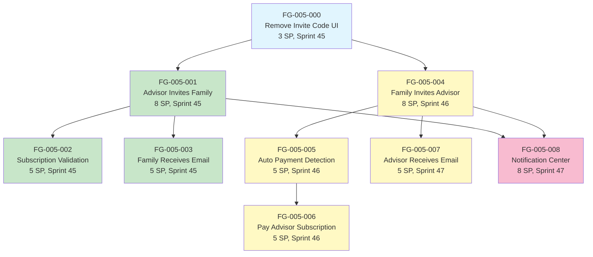

# EPIC-005: Story Recommendations & Planning Guide

## 📊 Sprint Distribution Overview

**Total Timeline:** 11 weeks across 3 sprints (Sprint 45-47)
**Total Story Points:** 49 SP (estimated 100h of development work)
**9 User Stories** organized in 4 phases for systematic delivery

### Sprint Breakdown

| Sprint | Phase | Stories | Story Points | Duration | Focus |
|--------|-------|---------|--------------|----------|-------|
| **Sprint 45** | Phase 0 | FG-005-000 | 3 SP | 1.5 weeks | Frontend Cleanup |
| **Sprint 45-46** | Phase 1 | FG-005-001, 002, 003 | 18 SP | 4 weeks | Advisor→Family Flow |
| **Sprint 46-47** | Phase 2 | FG-005-004, 005, 006, 007 | 20 SP | 5 weeks | Family→Advisor Flow |
| **Sprint 47** | Phase 3 | FG-005-008 | 8 SP | 1.5 weeks | Notifications |

---

## 🗺️ Story Dependency Graph



### Critical Path Analysis

**Longest Path:** S000 → S001 → S002 → [Integrated with S001] (11 weeks total)

**Parallel Development Opportunities:**
- Phase 1 stories (001-003) can be developed in parallel after 000 completes
- Phase 2 stories (004-007) can begin after 000 completes (independent of Phase 1)
- Story 008 depends on both 001 and 004, should start after Phase 1 & 2 foundations are laid

---

## ❓ Critical Questions from Lana's Analysis

### 🔴 Critical Priority (Must Resolve Before Sprint 45)

**Q1: Advisor Registration Model - OAuth vs Email?**
- **Question:** Should STORY-FG-001 OAuth registration include subscription selection on same form, or separate subscription step?
- **Impact:** Affects payment flow integration, user experience, and development effort
- **Options:**
  - A) Combined form (OAuth + subscription + payment in one flow) - reduces friction but more complex
  - B) Separate steps (OAuth → subscription selection → payment) - simpler but higher abandonment
- **Recommendation:** Option A (combined flow) - modern SaaS pattern, reduces abandonment
- **Decision Needed From:** Product Owner, UX Lead
- **Blocking:** FG-005-001 (cannot finalize invitation flow without knowing target registration UX)

**Q2: Stripe Integration Scope**
- **Question:** Are Stripe products/prices already configured, or must we create them as part of this epic?
- **Impact:** Defines scope of backend payment integration work
- **Options:**
  - A) Use existing Stripe configuration (reference only)
  - B) Create new Stripe products for Advisor Seats (requires Stripe dashboard setup)
- **Recommendation:** Verify existing configuration, create only if missing
- **Decision Needed From:** Backend Lead, Product Owner
- **Blocking:** FG-005-002 (subscription validation), FG-005-006 (payment processing)

**Q3: Email Service Configuration**
- **Question:** Is turbo_mail service ready for production email sending? What template system (MJML vs plain HTML)?
- **Impact:** Email sending reliability, template maintenance effort
- **Options:**
  - A) MJML templates (better email client compatibility, more setup)
  - B) Plain HTML/React Email (faster development, less compatible)
- **Recommendation:** MJML for production emails (better deliverability)
- **Decision Needed From:** DevOps Lead, Backend Lead
- **Blocking:** FG-005-003 (family receives email), FG-005-007 (advisor receives email)

**Q4: Invitation Token Security & Expiry**
- **Question:** What token generation algorithm and expiry policy?
- **Impact:** Security posture, user experience for delayed invitations
- **Options:**
  - A) 30-day expiry with secure random tokens (standard)
  - B) 7-day expiry (more secure but higher support burden)
  - C) No expiry (not recommended - security risk)
- **Recommendation:** Option A (30-day expiry, cryptographically secure tokens)
- **Decision Needed From:** Security Lead, Product Owner
- **Blocking:** FG-005-001, FG-005-004 (core invitation logic)

### 🟡 Medium Priority (Resolve During Sprint 45-46)

**Q5: Concurrent Invitation Handling**
- **Question:** What happens if advisor/family sends multiple invitations to same email before first is accepted?
- **Impact:** Data integrity, user confusion
- **Options:**
  - A) Block duplicate invitations (prevent UI, show error)
  - B) Allow duplicates but only honor first acceptance
  - C) Cancel previous invitation when new one sent
- **Recommendation:** Option A (block duplicates with clear messaging)
- **Decision Needed From:** Product Owner, UX Lead
- **Required For:** FG-005-001, FG-005-004 (validation logic)

**Q6: Subscription Plan Limits - Grace Period?**
- **Question:** If advisor at family limit, can they send invitation with grace period before payment required?
- **Impact:** Monetization vs user experience balance
- **Options:**
  - A) Hard block at limit (immediate payment required)
  - B) Grace period (allow invitation, require payment before acceptance)
- **Recommendation:** Option A (hard block) - clearer monetization signal
- **Decision Needed From:** Product Owner, Business Strategy
- **Required For:** FG-005-002 (subscription validation logic)

**Q7: Failed Payment Handling**
- **Question:** If family payment fails during advisor invitation (FG-005-006), what happens to invitation?
- **Impact:** User experience, data consistency
- **Options:**
  - A) Keep invitation in draft, allow retry
  - B) Cancel invitation, require restart
  - C) Allow invitation to send, block advisor registration until payment succeeds
- **Recommendation:** Option C (send invitation, gate registration on payment)
- **Decision Needed From:** Product Owner, Backend Lead
- **Required For:** FG-005-006 (payment failure scenarios)

### 🟢 Low Priority (Can Defer to Phase 3 or Future)

**Q8: Invitation Analytics & Tracking**
- **Question:** Should we track invitation open rates, click-through rates, time-to-acceptance metrics?
- **Impact:** Product insights, feature optimization
- **Options:**
  - A) Full analytics (email opens, clicks, conversion funnel)
  - B) Basic tracking (sent, accepted, rejected only)
- **Recommendation:** Option B for MVP, upgrade to A in future iteration
- **Decision Needed From:** Product Analytics, Product Owner
- **Required For:** Nice-to-have for FG-005-008 (notification enhancements)

---

## 🏗️ Technical Architecture Recommendations

### State Machine Pattern (Lana's Analysis)

Implement invitation state machine with 7 states:

```typescript
enum InvitationStatus {
  DRAFT = 'draft',           // Created but not sent
  SENT = 'sent',             // Email sent, awaiting open
  OPENED = 'opened',         // Email opened, awaiting action
  ACCEPTED = 'accepted',     // Invitation accepted (terminal)
  REJECTED = 'rejected',     // Invitation rejected (terminal)
  EXPIRED = 'expired',       // 30-day limit reached (terminal)
  CANCELLED = 'cancelled'    // Sender cancelled (terminal)
}

// Valid transitions
const transitions = {
  DRAFT: ['SENT', 'CANCELLED'],
  SENT: ['OPENED', 'EXPIRED', 'CANCELLED'],
  OPENED: ['ACCEPTED', 'REJECTED', 'EXPIRED'],
  // Terminal states have no transitions
  ACCEPTED: [],
  REJECTED: [],
  EXPIRED: [],
  CANCELLED: []
};
```

**Why This Matters:**
- Enforces valid state transitions at database level
- Prevents race conditions (concurrent state changes)
- Clear audit trail for support investigations
- Enables sophisticated notification logic (FG-005-008)

**Implementation:**
- Add `status` ENUM column to `invitations` table
- Add `status_changed_at` timestamp for audit
- Add database constraints to enforce valid transitions
- Add API validators to reject invalid transitions

### Repository Pattern with Multi-Tenancy

**Critical Pattern:** All invitation queries MUST filter by `family_id`

```typescript
class InvitationRepository {
  constructor(private context: { family_id: string }) {}

  async create(data: InvitationData): Promise<Invitation> {
    return prisma.invitation.create({
      data: {
        ...data,
        family_id: this.context.family_id, // CRITICAL
        token: generateSecureToken(),
        expires_at: addDays(new Date(), 30),
        status: 'DRAFT'
      }
    });
  }

  async findByToken(token: string): Promise<Invitation | null> {
    // Token lookup is exception - no family_id filter
    // (invite recipient doesn't have family_id yet)
    return prisma.invitation.findFirst({
      where: {
        token,
        expires_at: { gt: new Date() },
        status: { in: ['SENT', 'OPENED'] }
      }
    });
  }

  async findByFamily(): Promise<Invitation[]> {
    return prisma.invitation.findMany({
      where: {
        family_id: this.context.family_id, // CRITICAL
        status: { notIn: ['CANCELLED'] }
      },
      orderBy: { created_at: 'desc' }
    });
  }
}
```

**Testing Requirements:**
- MUST include multi-tenancy isolation tests for every query
- Test user from Family A cannot access Family B's invitations
- Test token-based lookup is exception (works cross-family)

### Email Template System

**Recommendation:** Use MJML for production email templates

```typescript
interface EmailTemplate {
  subject: string;
  mjmlTemplate: string;
  variables: Record<string, any>;
}

const templates = {
  ADVISOR_INVITE_FAMILY: {
    subject: '{{advisor_name}} invites you to Family Governance',
    mjmlTemplate: 'email-templates/advisor-invite-family.mjml',
    variables: ['advisor_name', 'family_name', 'invitation_link', 'advisor_firm']
  },
  FAMILY_INVITE_ADVISOR: {
    subject: '{{family_name}} requests your advisory services',
    mjmlTemplate: 'email-templates/family-invite-advisor.mjml',
    variables: ['family_name', 'advisor_role', 'invitation_link', 'family_size']
  }
};

async function sendInvitationEmail(
  type: keyof typeof templates,
  recipientEmail: string,
  variables: Record<string, any>
): Promise<void> {
  const template = templates[type];

  // Compile MJML to HTML
  const html = await compileMJML(template.mjmlTemplate, variables);

  // Send via turbo_mail service
  await mailService.send({
    to: recipientEmail,
    subject: interpolate(template.subject, variables),
    html
  });
}
```

**Template Variables by Story:**
- **FG-005-003** (Family receives email): `advisor_name`, `advisor_firm`, `advisor_specialization`, `family_name`, `invitation_link`
- **FG-005-007** (Advisor receives email): `family_name`, `advisor_role`, `family_size`, `invitation_link`, `subscription_status`

---

## 📋 Sprint Readiness Checklist

### Phase 0 Prerequisites (Sprint 45 Start)

**Technical:**
- [ ] Identify all invite code UI components to remove
- [ ] Verify no backend dependencies on invite code system
- [ ] Confirm frontend test coverage for affected components

**Business:**
- [ ] Stakeholder approval to deprecate invite code system
- [ ] Communication plan for users (in-app announcement)
- [ ] Support team briefed on feature deprecation

**Estimate:** 8 hours (3 SP) - can start immediately

---

### Phase 1 Prerequisites (Sprint 45 Start - After Phase 0)

**Critical Questions Resolved:**
- [ ] **Q1:** Advisor OAuth registration flow finalized (integrated vs separate)
- [ ] **Q2:** Stripe configuration verified (products/prices exist)
- [ ] **Q3:** Email service production-ready (turbo_mail configured)
- [ ] **Q4:** Invitation token security policy decided (30-day expiry confirmed)

**Technical:**
- [ ] turbo_auth service supports advisor registration
- [ ] Database schema for `invitations` table designed
- [ ] Email template designs approved (FG-005-003)
- [ ] Stripe API integration tested (FG-005-002)

**Dependencies:**
- [ ] **STORY-FG-001** (Advisor OAuth Registration) completed or near completion
- [ ] turbo_mail service deployed and tested
- [ ] Advisor Portal has subscription management UI

**Estimate:** 36 hours (18 SP) - requires 4 weeks with parallel development

---

### Phase 2 Prerequisites (Sprint 46 Start - Parallel with Phase 1 End)

**Critical Questions Resolved:**
- [ ] **Q5:** Concurrent invitation handling strategy decided
- [ ] **Q6:** Subscription limit enforcement policy decided (hard block vs grace)
- [ ] **Q7:** Failed payment handling approach decided

**Technical:**
- [ ] Family Portal has "Invite Advisor" UI mockups
- [ ] Stripe Checkout integration tested
- [ ] Role selection UI designed (Personal Family Advisor vs External Consul)
- [ ] Advisor registration flow supports invitation tokens

**Dependencies:**
- [ ] Phase 0 completed (invite code UI removed)
- [ ] Stripe payment integration working
- [ ] Email template system functional

**Estimate:** 44 hours (20 SP) - requires 5 weeks with parallel development

---

### Phase 3 Prerequisites (Sprint 47 Start - After Phase 1 & 2)

**Technical:**
- [ ] Notification service supports invitation events
- [ ] Frontend notification centers exist (Advisor Portal + Family Portal)
- [ ] WebSocket or polling mechanism for real-time notifications

**Dependencies:**
- [ ] **FG-005-001** (Advisor invites family) completed
- [ ] **FG-005-004** (Family invites advisor) completed
- [ ] Notification infrastructure operational

**Estimate:** 16 hours (8 SP) - requires 1.5 weeks

---

## ✅ Success Metrics (From Epic)

### Technical Metrics

| Metric | Target | Story |
|--------|--------|-------|
| Email delivery rate | > 95% | FG-005-003, FG-005-007 |
| Token security | 0 vulnerabilities | FG-005-001, FG-005-004 |
| Multi-tenancy compliance | 100% isolation | All stories |
| API response time (p95) | < 200ms | All stories |
| Payment success rate | > 90% | FG-005-006 |

### Business Metrics

| Metric | Target | Story |
|--------|--------|-------|
| Invitation acceptance rate | > 60% within 7 days | FG-005-001, FG-005-004 |
| Registration completion after email click | > 70% | FG-005-003, FG-005-007 |
| Payment conversion (when prompted) | > 50% | FG-005-006 |
| Time-to-first-invitation sent | < 5 minutes | FG-005-001 |
| Notification delivery time | < 30 seconds | FG-005-008 |

### User Experience Metrics

| Metric | Target | Story |
|--------|--------|-------|
| Advisor onboarding time | < 10 minutes | FG-005-001, FG-005-002, FG-005-003 |
| Family onboarding time (via invitation) | < 8 minutes | FG-005-003 |
| Advisor onboarding time (via family invitation) | < 12 minutes | FG-005-007 |
| Support tickets related to invitations | < 5% of invitations sent | All stories |

---

## 🚀 Implementation Recommendations

### Story Sequencing Strategy

**Recommended Order:**
1. **Sprint 45 Week 1-2:** FG-005-000 (cleanup) → unblocks everything
2. **Sprint 45 Week 2-3:** FG-005-001 + FG-005-002 (parallel) → core Path 1
3. **Sprint 45 Week 4:** FG-005-003 → completes Path 1 MVP
4. **Sprint 46 Week 1-2:** FG-005-004 + FG-005-005 (parallel) → core Path 2
5. **Sprint 46 Week 3-4:** FG-005-006 + FG-005-007 (sequential) → completes Path 2
6. **Sprint 47 Week 1-2:** FG-005-008 → adds notifications

**Why This Order:**
- Cleanup first (000) prevents confusion during development
- Path 1 (Advisor→Family) is simpler, provides early value
- Path 2 (Family→Advisor) builds on Path 1 patterns
- Notifications (008) enhance both paths, added last

### Testing Strategy by Phase

**Phase 0 (Cleanup):**
- [ ] Frontend component tests (removed UI doesn't break app)
- [ ] E2E navigation tests (no 404 errors from old routes)
- [ ] Backend API smoke tests (endpoints still functional)

**Phase 1 (Path 1 - Advisor→Family):**
- [ ] Integration tests (email sending, token validation)
- [ ] Multi-tenancy tests (family isolation)
- [ ] Subscription validation tests (limit enforcement)
- [ ] E2E flow tests (invite → email → registration → acceptance)

**Phase 2 (Path 2 - Family→Advisor):**
- [ ] Payment integration tests (Stripe checkout, webhooks)
- [ ] Role assignment tests (Personal vs External Consul permissions)
- [ ] Duplicate invitation prevention tests
- [ ] E2E flow tests (invite → payment → email → registration)

**Phase 3 (Notifications):**
- [ ] Notification delivery tests (timing, content)
- [ ] Real-time notification tests (WebSocket/polling)
- [ ] Cross-portal notification tests (Advisor + Family portals)

---

## 📚 Related Documentation

- **Epic Document:** `epic-advisor-family-mutual-connection-email-invitations.md`
- **Lana's Full Analysis:** Comprehensive requirements analysis output (in session context)
- **Architecture References:**
  - CLAUDE.md - Core FG architecture principles
  - .claude/contexts/turbo.md - Turbo stack patterns (Hono, Prisma, Better Auth)
  - .claude/contexts/backend.md - Backend microservices architecture
  - .claude/contexts/frontend.md - Frontend portal patterns

---

## 🔄 Next Steps

### Immediate Actions (This Week)

1. **Resolve Critical Questions (Q1-Q4)**
   - Schedule stakeholder meeting to answer Q1 (OAuth flow)
   - Verify Stripe configuration (Q2)
   - Confirm email service status (Q3)
   - Approve token security policy (Q4)

2. **Sprint 45 Planning**
   - Assign FG-005-000 to frontend developer (start immediately)
   - Prepare backlog for FG-005-001, 002, 003
   - Review designs for invitation emails

3. **Technical Preparation**
   - Set up invitation database schema (Prisma migrations)
   - Configure MJML email templates repository
   - Test turbo_mail service integration

### Week 2-3 Actions

1. **Begin Phase 1 Development**
   - FG-005-001: Advisor invitation backend + UI
   - FG-005-002: Subscription validation integration

2. **Design Validation**
   - Review email templates with stakeholders
   - UX testing for invitation flows

3. **Prepare Phase 2**
   - Design Family Portal "Invite Advisor" UI
   - Plan Stripe payment integration approach

---

**Document Version:** 1.0
**Last Updated:** 2025-10-20
**Created By:** Requirements Expert (Lana Rex) + Taskmaster
**Epic Owner:** Eduard Izgorodin
